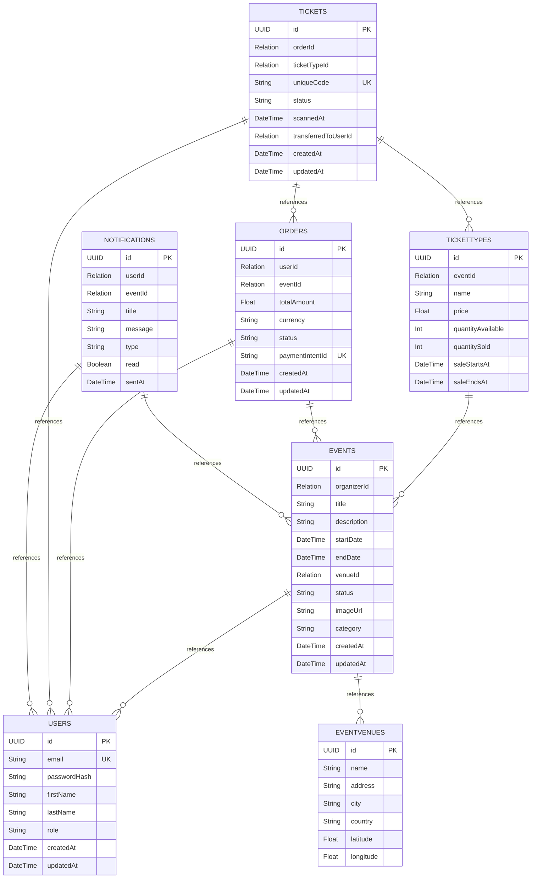
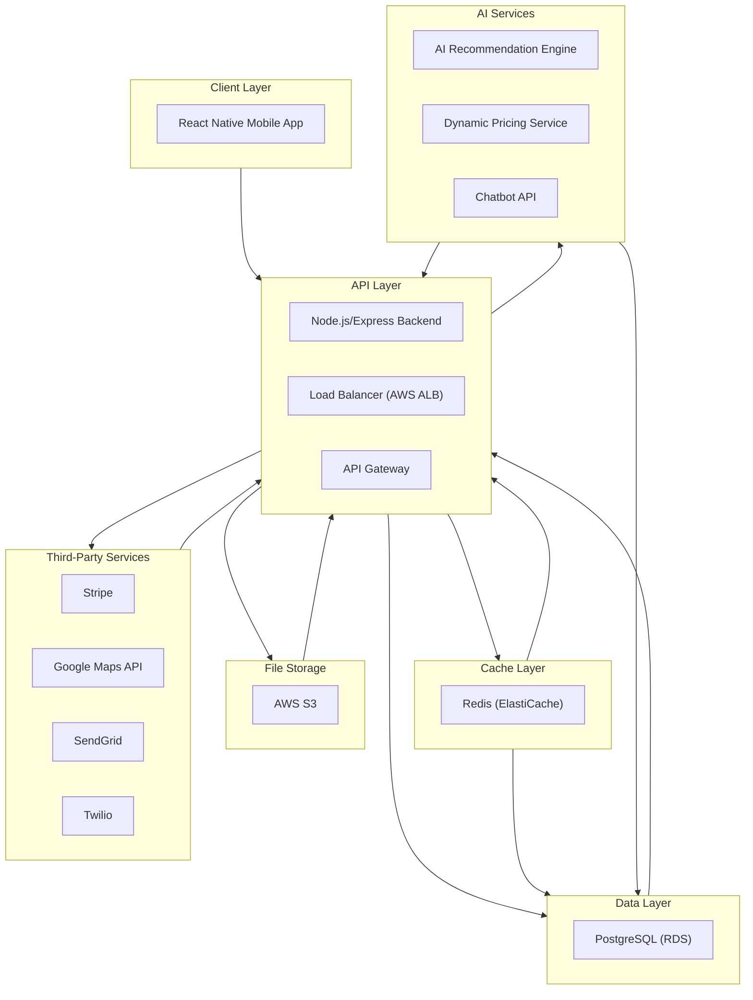
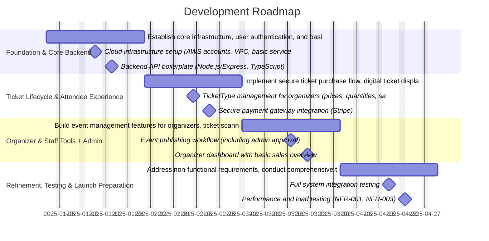
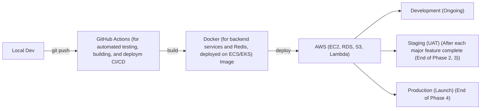

# Software Architecture Blueprint

## make an prototype of ticket app

| Field | Value |
|---|---|
| Generated | June 25, 2026 |
| Blueprint ID | `0822bdfc` |
| AI Model | `gemini-2.5-flash` |
| Prompt Version | `v1` |
| Generation Time | 222.3s |
| Source | 🤖 AI Generated |
| Blueprint Score | **85/100** |

---

# 1. Executive Summary
A streamlined mobile application that simplifies event creation and ticket sales for organizers, while offering a seamless ticket purchasing and management experience for attendees. It aims to reduce administrative overhead and enhance user satisfaction.

| Attribute | Detail |
|---|---|
| Project Type | Mobile App |
| Industry | Event Management |
| Target Audience | Event Organizers, Event Attendees |
| Estimated Complexity | medium |
| Development Timeline | 4-6 months |
| Suggested Team Size | 1 PM, 2 Backend Devs, 2 Frontend/Mobile Devs, 1 UI/UX |

# 2. Problem Statement
Inefficient manual ticketing processes, lack of real-time insights for event organizers, and fragmented attendee experiences often lead to frustration. This app solves these by providing a centralized, intuitive platform for digital ticketing and event management.

# 3. Proposed Solution
A streamlined mobile application that simplifies event creation and ticket sales for organizers, while offering a seamless ticket purchasing and management experience for attendees. It aims to reduce administrative overhead and enhance user satisfaction.

### Market Context
**Market Size:** large
**Competition Level:** high
**Industry:** Event Ticketing
**Sub-Industry:** Digital Event Management, Mobile Ticketing

## Key Risks
- User adoption by event organizers due to established competitors
- Payment gateway integration complexities and security concerns
- Scalability issues during high-demand ticket releases
- Data privacy and compliance with regional regulations
- Dependence on third-party APIs (e.g., mapping, payment)

## Critical Success Factors
- Intuitive and user-friendly interface for both organizers and attendees
- Robust and secure payment processing capabilities
- Reliable real-time event updates and notifications
- Effective marketing and outreach to attract initial organizers and events
- Strong customer support for organizers and attendees
---

# 4. Business Objectives
**Business Model:** Mobile App
**Pricing Strategy:** Freemium / Subscription


### Revenue Streams
- Advanced Analytics Dashboard for Organizers (Pro)
- Customizable Event Pages & Branding (Pro/Enterprise)
- Integrated Marketing Tools (Email & SMS) (Pro/Enterprise)
# 5. Target Users
| Segment | Description |
|---|---|
| Primary | Small to medium-sized event organizers (e.g., local concert promoters, workshop hosts, community event organizers) |
| Secondary | Event attendees (individuals looking to purchase and manage tickets for various events) |
| Tertiary | Venue managers or event staff responsible for ticket validation at entry points |

---

# 6. Functional Requirements
| ID | Title | Priority | Complexity | Category |
|---|---|---|---|---|
| FR-001 | User Registration and Login | must-have | medium | User Authentication |
| FR-002 | Event Creation and Publishing | must-have | high | Event Management |
| FR-003 | Ticket Type Configuration | must-have | medium | Ticket Sales |
| FR-004 | Secure Ticket Purchase Flow | must-have | high | Ticket Purchase |
| FR-005 | Digital Ticket Display (QR/Barcode) | must-have | medium | Ticket Management |
| FR-006 | Ticket Scanning and Validation | must-have | high | Event Entry |
| FR-007 | Event Search and Filtering | should-have | medium | Event Discovery |
| FR-008 | Order History and Past Events | should-have | low | User Profile |
| FR-009 | Event Announcements/Notifications | should-have | medium | Communication |


### FR-001: User Registration and Login
Users (organizers/attendees) must be able to create an account and log in securely using email/password or social login.

### FR-002: Event Creation and Publishing
Event organizers must be able to create, edit, and publish new events with details like title, description, dates, venue, and images.

### FR-003: Ticket Type Configuration
Organizers must be able to define multiple ticket types (e.g., General Admission, VIP, Early Bird) with different prices, quantities, and sales periods.

### FR-004: Secure Ticket Purchase Flow
Attendees must be able to browse events, select tickets, add them to a cart, and complete a secure payment transaction.

### FR-005: Digital Ticket Display (QR/Barcode)
Purchased tickets must be accessible within the app, displaying a unique QR code or barcode for entry validation.

### FR-006: Ticket Scanning and Validation
Event staff must be able to scan QR/barcodes using a mobile device to validate tickets at the event entrance and mark them as used.

### FR-007: Event Search and Filtering
Attendees must be able to search for events by keywords, date, location, category, and apply filters.

### FR-008: Order History and Past Events
Attendees must be able to view a history of their past ticket purchases and events attended.

### FR-009: Event Announcements/Notifications
Organizers should be able to send announcements or updates to all ticket holders for a specific event.

# 7. Non-Functional Requirements
| ID | Title | Category | Metric |
|---|---|---|---|
| NFR-001 | Fast Ticket Purchase Process | Performance | Page load time < 2s; Transaction completion < 5s |
| NFR-002 | Secure Payment Processing | Security | PCI DSS Level 1 compliance, TLS 1.2+ encryption |
| NFR-003 | High Concurrency Support | Scalability | 99.9% uptime during peak load, response time within 3 seconds for 10,000 concurrent users |
| NFR-004 | Intuitive User Interface | Usability | System Usability Scale (SUS) score > 80, Task completion rate > 95% |
| NFR-005 | High Availability | Reliability | 99.95% uptime annually |

---

# 8. Feature Breakdown

## 8.1 Core Features

### CF-001: User Authentication & Profiles
Allows users to create accounts, log in, manage their personal information, and set preferences.

> 💡 **User Benefit:** Provides secure access to the platform and personalized experience.

**Estimated Effort:** Medium

**Sub-features:**
- Sign Up (Email/Password, Social Login)
- Login & Forgot Password
- Profile Management (Edit details, password change)
- User Role Management (Organizer/Attendee)


### CF-002: Event Discovery & Search
Enables attendees to browse, search, and filter events based on various criteria like category, date, location.

> 💡 **User Benefit:** Helps users find relevant and interesting events efficiently.

**Estimated Effort:** Medium

**Sub-features:**
- Homepage Event Feed
- Keyword Search
- Category Filters
- Date & Location Filters


### CF-003: Event Creation & Management for Organizers
Provides a dashboard and tools for organizers to create, edit, and publish their events.

> 💡 **User Benefit:** Simplifies the process of setting up and managing events, saving time and effort.

**Estimated Effort:** High

**Sub-features:**
- Event Details Form (Title, Description, Dates, Venue)
- Ticket Type Configuration (Price, Quantity, Sales Period)
- Event Draft & Publishing Workflow
- Event Dashboard (Overview, Status)


### CF-004: Secure Ticket Purchase & Payment
Facilitates a seamless and secure process for attendees to select and purchase tickets.

> 💡 **User Benefit:** Enables quick and reliable transaction for event access.

**Estimated Effort:** High

**Sub-features:**
- Ticket Selection Interface
- Shopping Cart Functionality
- Payment Gateway Integration (Stripe, PayPal)
- Order Confirmation & Receipt Generation


### CF-005: Digital Ticket Wallet & Display
Allows attendees to access and view their purchased tickets with unique scannable QR/barcodes.

> 💡 **User Benefit:** Conveniently stores and presents tickets for easy entry, eliminating physical tickets.

**Estimated Effort:** Medium

**Sub-features:**
- My Tickets Section
- Individual Ticket View (QR/Barcode, Event Info)
- Order History


### CF-006: Ticket Scanning & Validation (Entry Management)
Provides a dedicated scanning tool for event staff to validate tickets at the event entrance.

> 💡 **User Benefit:** Ensures efficient and secure entry management, preventing fraudulent entries.

**Estimated Effort:** High

**Sub-features:**
- Camera-based QR/Barcode Scanner
- Real-time Ticket Validation (Valid, Used, Invalid)
- Manual Ticket Lookup
- Entry/Exit Tracking


## 8.2 Admin Features

### AF-001: Event Moderation Dashboard
Allows administrators to review, approve, reject, or unpublish events created by organizers.

**Sub-features:**
- List of Pending/Active/Rejected Events
- Event Detail Review
- Approval/Rejection Workflow
- Audit Trail for Moderation Actions


### AF-002: User Account Management
Provides tools for administrators to view, edit, suspend, or delete user accounts.

**Sub-features:**
- User Search & Filter
- User Profile View
- Account Status Management (Active, Suspended, Banned)
- Role Assignment


### AF-003: Transaction & Refund Management
Enables administrators to track all platform transactions and process refund requests.

**Sub-features:**
- Transaction History View
- Refund Initiation & Processing
- Payment Gateway Logs
- Financial Reporting


## 8.3 AI Features

### AI-001: Personalized Event Recommendations
Suggests events to attendees based on their past purchases, browsing history, and explicit preferences.


### AI-002: Dynamic Pricing Suggestions for Organizers
Provides organizers with data-driven recommendations for optimal ticket pricing based on demand, event type, and historical data.


### AI-003: AI-powered Chatbot Support
An intelligent chatbot to answer frequently asked questions from attendees and organizers, reducing the load on human support.


## 8.4 Premium Features

### PF-001: Advanced Analytics Dashboard for Organizers
Offers in-depth insights into ticket sales, attendee demographics, marketing channel effectiveness, and event performance.


### PF-002: Customizable Event Pages & Branding
Allows organizers to fully customize their event pages with custom branding, themes, and layouts beyond standard templates.


### PF-003: Integrated Marketing Tools (Email & SMS)
Enables organizers to create and send targeted email campaigns or SMS notifications to ticket holders or interested users directly from the platform.


# 9. User Roles & Permissions

### Public / Guest
- Browse public content
- Register / sign up

### Authenticated User
- As an event attendee, I want to browse upcoming events by category or location
- As an event attendee, I want to purchase multiple tickets for an event
- As an event attendee, I want to see my purchased tickets with a scannable code
- As an event organizer, I want to create a new event listing with all necessary details

### Admin
- As a platform administrator, I want to approve or reject newly submitted events
- As a platform administrator, I want to view and manage user accounts (organizers and attendees)
- As a platform administrator, I want to initiate and process refunds for ticket purchases

### Super Admin
- Full system access
- Manage all users
- Configure platform settings

---

# 10. Recommended Tech Stack
| Layer | Technology |
|---|---|


### Third-Party Integrations
| Service | Type | Required |
|---|---|---|
| Stripe | Payment Gateway | ✅ |
| Google Maps API | Mapping & Location Services | ✅ |
| SendGrid | Email Service Provider | ✅ |
| Twilio | SMS Service Provider | — |

---

# 11. Database Design
**Database Type:** PostgreSQL

A relational database will store structured data like user profiles, event details, ticket information, and orders. PostgreSQL is chosen for its robustness, ACID compliance, and strong support for complex queries and transactional integrity, critical for a ticketing system. It will be complemented by Redis for caching frequently accessed data to improve performance, especially during peak ticket sales.

### Design Decisions
- Relational model with strong foreign key constraints to ensure data integrity across users, events, tickets, and orders.
- UUIDs for primary keys to allow for distributed generation and prevent sequential enumeration attacks.
- Use of `status` fields in Events, Orders, and Tickets tables to manage lifecycle states and facilitate filtering.
- ACID transactions for critical operations like ticket purchases and updates to ensure reliability and consistency.
- Indexes on frequently queried fields (e.g., foreign keys, dates, status) to optimize read performance.
- Separate `EventVenues` table to reduce data redundancy and allow venues to be linked to multiple events.
**Scaling Strategy:** Database scaling will involve horizontal partitioning (sharding) for high-traffic tables like `Tickets` and `Orders` if necessary, read replicas for scaling read operations, and connection pooling for efficient resource utilization. Caching with Redis will offload frequent read requests from the database.

## Collection / Table: `Users`
Stores user account information, including organizers, attendees, and administrators.

| Field | Type | Required | Default | Description |
|---|---|---|---|---|
| `id` | `UUID` | ✅ | `uuid_generate_v4()` | Unique identifier for the user |
| `email` | `String` | ✅ | — | User's email address, used for login |
| `passwordHash` | `String` | ✅ | — | Hashed password for security |
| `firstName` | `String` | ✅ | — | User's first name |
| `lastName` | `String` | ✅ | — | User's last name |
| `role` | `String` | ✅ | `'attendee'` | User role (attendee, organizer, admin, staff) |
| `createdAt` | `DateTime` | ✅ | `CURRENT_TIMESTAMP` | Timestamp of user creation |
| `updatedAt` | `DateTime` | ✅ | `CURRENT_TIMESTAMP` | Timestamp of last update |

**Indexes:** `email` (unique, unique) · `role` (single)


## Collection / Table: `Events`
Stores details about events created by organizers.

| Field | Type | Required | Default | Description |
|---|---|---|---|---|
| `id` | `UUID` | ✅ | `uuid_generate_v4()` | Unique identifier for the event |
| `organizerId` | `Relation` | ✅ | — | Foreign key to the Users table (organizer) |
| `title` | `String` | ✅ | — | Title of the event |
| `description` | `String` | ✅ | — | Detailed description of the event |
| `startDate` | `DateTime` | ✅ | — | Start date and time of the event |
| `endDate` | `DateTime` | ✅ | — | End date and time of the event |
| `venueId` | `Relation` | ✅ | — | Foreign key to the EventVenues table |
| `status` | `String` | ✅ | `'draft'` | Current status of the event (draft, pending_approval, published, cancelled, completed) |
| `imageUrl` | `String` | — | — | URL to the event's main image |
| `category` | `String` | — | — | Category of the event (e.g., Music, Sport, Workshop) |
| `createdAt` | `DateTime` | ✅ | `CURRENT_TIMESTAMP` | Timestamp of event creation |
| `updatedAt` | `DateTime` | ✅ | `CURRENT_TIMESTAMP` | Timestamp of last update |

**Indexes:** `organizerId` (single) · `startDate` (single) · `status` (single) · `category, startDate` (compound)


## Collection / Table: `EventVenues`
Stores details about event venues.

| Field | Type | Required | Default | Description |
|---|---|---|---|---|
| `id` | `UUID` | ✅ | `uuid_generate_v4()` | Unique identifier for the venue |
| `name` | `String` | ✅ | — | Name of the venue |
| `address` | `String` | ✅ | — | Full address of the venue |
| `city` | `String` | ✅ | — | City where the venue is located |
| `country` | `String` | ✅ | — | Country where the venue is located |
| `latitude` | `Float` | — | — | Latitude coordinate of the venue |
| `longitude` | `Float` | — | — | Longitude coordinate of the venue |

**Indexes:** `city` (single)


## Collection / Table: `TicketTypes`
Defines different types of tickets available for an event (e.g., VIP, General Admission).

| Field | Type | Required | Default | Description |
|---|---|---|---|---|
| `id` | `UUID` | ✅ | `uuid_generate_v4()` | Unique identifier for the ticket type |
| `eventId` | `Relation` | ✅ | — | Foreign key to the Events table |
| `name` | `String` | ✅ | — | Name of the ticket type (e.g., 'General Admission') |
| `price` | `Float` | ✅ | — | Price of a single ticket of this type |
| `quantityAvailable` | `Int` | ✅ | — | Total number of tickets of this type available for sale |
| `quantitySold` | `Int` | ✅ | `0` | Number of tickets of this type already sold |
| `saleStartsAt` | `DateTime` | — | — | Date and time when sales for this ticket type begin |
| `saleEndsAt` | `DateTime` | — | — | Date and time when sales for this ticket type end |

**Indexes:** `eventId` (single)


## Collection / Table: `Orders`
Records individual ticket purchase transactions.

| Field | Type | Required | Default | Description |
|---|---|---|---|---|
| `id` | `UUID` | ✅ | `uuid_generate_v4()` | Unique identifier for the order |
| `userId` | `Relation` | ✅ | — | Foreign key to the Users table (attendee) |
| `eventId` | `Relation` | ✅ | — | Foreign key to the Events table |
| `totalAmount` | `Float` | ✅ | — | Total amount paid for the order |
| `currency` | `String` | ✅ | `'USD'` | Currency of the transaction |
| `status` | `String` | ✅ | `'pending'` | Status of the order (pending, completed, failed, refunded) |
| `paymentIntentId` | `String` | — | — | ID from the payment gateway for this transaction |
| `createdAt` | `DateTime` | ✅ | `CURRENT_TIMESTAMP` | Timestamp of order creation |
| `updatedAt` | `DateTime` | ✅ | `CURRENT_TIMESTAMP` | Timestamp of last update |

**Indexes:** `userId` (single) · `eventId` (single) · `paymentIntentId` (unique, unique)


## Collection / Table: `Tickets`
Represents each individual ticket purchased, including its unique scannable code.

| Field | Type | Required | Default | Description |
|---|---|---|---|---|
| `id` | `UUID` | ✅ | `uuid_generate_v4()` | Unique identifier for the individual ticket |
| `orderId` | `Relation` | ✅ | — | Foreign key to the Orders table |
| `ticketTypeId` | `Relation` | ✅ | — | Foreign key to the TicketTypes table |
| `uniqueCode` | `String` | ✅ | — | Unique QR/barcode string for ticket validation |
| `status` | `String` | ✅ | `'purchased'` | Status of the ticket (purchased, scanned, transferred, refunded, cancelled) |
| `scannedAt` | `DateTime` | — | — | Timestamp when the ticket was scanned for entry |
| `transferredToUserId` | `Relation` | — | — | Foreign key to the Users table if ticket was transferred |
| `createdAt` | `DateTime` | ✅ | `CURRENT_TIMESTAMP` | Timestamp of ticket creation (purchase) |
| `updatedAt` | `DateTime` | ✅ | `CURRENT_TIMESTAMP` | Timestamp of last update |

**Indexes:** `orderId` (single) · `ticketTypeId` (single) · `uniqueCode` (unique, unique) · `transferredToUserId` (single)


## Collection / Table: `Notifications`
Stores notifications to be sent to users, either system-wide or event-specific.

| Field | Type | Required | Default | Description |
|---|---|---|---|---|
| `id` | `UUID` | ✅ | `uuid_generate_v4()` | Unique identifier for the notification |
| `userId` | `Relation` | — | — | Foreign key to Users (if targeted notification) |
| `eventId` | `Relation` | — | — | Foreign key to Events (if event-specific) |
| `title` | `String` | ✅ | — | Title of the notification |
| `message` | `String` | ✅ | — | Content of the notification |
| `type` | `String` | ✅ | `'system'` | Type of notification (system, event_update, marketing) |
| `read` | `Boolean` | ✅ | `false` | Whether the user has read the notification |
| `sentAt` | `DateTime` | ✅ | `CURRENT_TIMESTAMP` | Timestamp when the notification was sent |

**Indexes:** `userId, read` (compound) · `eventId` (single)


# 12. Entity Relationships


---

# 13. API Documentation
**Base URL:** /api/v1
**Authentication:** JWT (JSON Web Tokens) with Passport.js for Node.js. Tokens will be stored securely (e.g., HttpOnly cookies) and refreshed as needed.

**Global Middleware:** AuthenticationMiddleware (JWT validation), AuthorizationMiddleware (Role-based access control), ErrorHandlerMiddleware, RequestLoggerMiddleware, RateLimitMiddleware


## Group: Authentication

### `POST` `/auth/register`
Registers a new user (attendee or organizer).

| Property | Value |
|---|---|
| Auth Required | none |
| Rate Limit | 10 requests/minute |

**Request Body:**
```json
{
  "email": "string",
  "password": "string",
  "firstName": "string",
  "lastName": "string",
  "role": "string (attendee|organizer)"
}
```

**Responses:**
- `200` — User registered successfully
- `400` — Invalid input or email already exists
- `500` — Server error


### `POST` `/auth/login`
Logs in a user and returns a JWT token.

| Property | Value |
|---|---|
| Auth Required | none |
| Rate Limit | 10 requests/minute |

**Request Body:**
```json
{
  "email": "string",
  "password": "string"
}
```

**Responses:**
- `200` — Login successful
- `401` — Invalid credentials
- `500` — Server error


### `POST` `/auth/refresh`
Refreshes an expired JWT token.

| Property | Value |
|---|---|
| Auth Required | user |
| Rate Limit | 5 requests/minute |

**Request Body:**
```json
{
  "refreshToken": "string"
}
```

**Responses:**
- `200` — Token refreshed successfully
- `401` — Invalid refresh token


## Group: Events (Public)

### `GET` `/events`
Retrieves a list of all published events.

| Property | Value |
|---|---|
| Auth Required | none |
| Rate Limit | 60 requests/minute |

**Responses:**
- `200` — List of events
- `500` — Server error


### `GET` `/events/:id`
Retrieves details for a specific event.

| Property | Value |
|---|---|
| Auth Required | none |
| Rate Limit | 60 requests/minute |

**Responses:**
- `200` — Event details
- `404` — Event not found
- `500` — Server error


### `GET` `/events/:id/ticket-types`
Retrieves available ticket types for a specific event.

| Property | Value |
|---|---|
| Auth Required | none |
| Rate Limit | 60 requests/minute |

**Responses:**
- `200` — List of ticket types
- `404` — Event not found
- `500` — N/A


## Group: Organizer Management

### `POST` `/organizer/events`
Creates a new event (organizer only).

| Property | Value |
|---|---|
| Auth Required | user |
| Rate Limit | 30 requests/minute |

**Request Body:**
```json
{
  "title": "string",
  "description": "string",
  "startDate": "datetime",
  "endDate": "datetime",
  "venueId": "UUID",
  "imageUrl": "string",
  "category": "string"
}
```

**Responses:**
- `201` — Event created successfully
- `400` — Invalid input
- `401` — Unauthorized
- `403` — Forbidden: Not an organizer
- `500` — Server error


### `PUT` `/organizer/events/:id`
Updates an existing event (organizer only).

| Property | Value |
|---|---|
| Auth Required | user |
| Rate Limit | 30 requests/minute |

**Request Body:**
```json
{
  "title": "string",
  "description": "string",
  "startDate": "datetime",
  "endDate": "datetime",
  "venueId": "UUID",
  "imageUrl": "string",
  "category": "string",
  "status": "string (draft|pending_approval|published|cancelled)"
}
```

**Responses:**
- `200` — Event updated successfully
- `400` — Invalid input
- `401` — Unauthorized
- `403` — Forbidden: Not event owner or admin
- `404` — Event not found
- `500` — Server error


### `GET` `/organizer/events`
Retrieves all events created by the authenticated organizer.

| Property | Value |
|---|---|
| Auth Required | user |
| Rate Limit | 60 requests/minute |

**Responses:**
- `200` — List of organizer's events
- `401` — Unauthorized
- `403` — Forbidden: Not an organizer


### `GET` `/organizer/events/:id/sales`
Retrieves sales data for a specific event (organizer only).

| Property | Value |
|---|---|
| Auth Required | user |
| Rate Limit | 30 requests/minute |

**Responses:**
- `200` — Sales data for the event
- `401` — Unauthorized
- `403` — Forbidden: Not event owner or admin
- `404` — Event not found


## Group: Attendee Ticket & Order Management

### `POST` `/tickets/purchase`
Initiates a secure payment and creates tickets for an event.

| Property | Value |
|---|---|
| Auth Required | user |
| Rate Limit | 10 requests/minute |

**Request Body:**
```json
{
  "eventId": "UUID",
  "ticketSelections": [
    {
      "ticketTypeId": "UUID",
      "quantity": "number"
    }
  ],
  "paymentMethodId": "string"
}
```

**Responses:**
- `201` — Tickets purchased successfully
- `400` — Invalid request, insufficient tickets, or payment failed
- `401` — Unauthorized
- `500` — Server error


### `GET` `/me/tickets`
Retrieves all purchased tickets for the authenticated user.

| Property | Value |
|---|---|
| Auth Required | user |
| Rate Limit | 60 requests/minute |

**Responses:**
- `200` — List of user's tickets
- `401` — Unauthorized
- `500` — Server error


### `GET` `/me/tickets/:id`
Retrieves details of a specific purchased ticket, including QR/barcode.

| Property | Value |
|---|---|
| Auth Required | user |
| Rate Limit | 60 requests/minute |

**Responses:**
- `200` — Ticket details
- `401` — Unauthorized
- `403` — Forbidden: Not ticket owner
- `404` — Ticket not found


### `GET` `/me/orders`
Retrieves all order history for the authenticated user.

| Property | Value |
|---|---|
| Auth Required | user |
| Rate Limit | 60 requests/minute |

**Responses:**
- `200` — List of user's orders
- `401` — Unauthorized
- `500` — Server error


## Group: Event Entry Management (Staff)

### `POST` `/staff/scan`
Scans and validates a ticket for entry.

| Property | Value |
|---|---|
| Auth Required | staff |
| Rate Limit | 60 requests/minute |

**Request Body:**
```json
{
  "uniqueCode": "string",
  "eventId": "UUID"
}
```

**Responses:**
- `200` — Ticket is valid and marked as used
- `400` — Invalid unique code or event ID mismatch
- `401` — Unauthorized
- `403` — Forbidden: Not event staff or assigned to this event
- `404` — Ticket not found
- `409` — Ticket already used
- `500` — Server error


### `GET` `/staff/events/:id/entry-stats`
Retrieves real-time entry statistics for an event (staff/organizer).

| Property | Value |
|---|---|
| Auth Required | user |
| Rate Limit | 30 requests/minute |

**Responses:**
- `200` — Entry statistics
- `401` — Unauthorized
- `403` — Forbidden: Not event staff/organizer
- `404` — Event not found


## Group: Admin Operations

### `PATCH` `/admin/events/:id/approve`
Approves a pending event (admin only).

| Property | Value |
|---|---|
| Auth Required | admin |
| Rate Limit | 30 requests/minute |

**Responses:**
- `200` — Event approved and published
- `401` — Unauthorized
- `403` — Forbidden: Not admin
- `404` — Event not found or not in pending status


### `POST` `/admin/orders/:id/refund`
Processes a refund for a specific order (admin only).

| Property | Value |
|---|---|
| Auth Required | admin |
| Rate Limit | 10 requests/minute |

**Request Body:**
```json
{
  "reason": "string"
}
```

**Responses:**
- `200` — Order refunded successfully
- `400` — Refund failed or order not eligible
- `401` — Unauthorized
- `403` — Forbidden: Not admin
- `404` — Order not found


### `GET` `/admin/users`
Retrieves a list of all user accounts with filtering (admin only).

| Property | Value |
|---|---|
| Auth Required | admin |
| Rate Limit | 30 requests/minute |

**Responses:**
- `200` — List of user accounts
- `401` — Unauthorized
- `403` — Forbidden: Not admin


## Webhooks

### stripe.payment_intent.succeeded
Receives notifications from Stripe when a payment is successful, to update order status.


### stripe.payment_intent.payment_failed
Receives notifications from Stripe when a payment fails, to update order status.


---

# 14. System Architecture
The system will follow a client-server architecture. The mobile application, built with React Native, will serve as the frontend, communicating with a RESTful API backend built on Node.js/Express. PostgreSQL will serve as the primary persistent data store, with Redis used for caching to enhance performance. File storage for images (e.g., event banners) will leverage AWS S3. Third-party integrations will handle payments (Stripe), email (SendGrid), and location services (Google Maps API).



### Frontend
**type:** SPA
**framework:** React Native
**stateManagement:** Redux Toolkit (or React Context API for simpler cases)
**keyLibraries:** React Navigation, Axios, Formik/Yup, React Native Camera (for QR scanning), React Native Maps, React Native Push Notifications


### Backend
**type:** Monolith
**framework:** Node.js/Express (with TypeScript)
**keyModules:** Authentication & Authorization, User Management, Event Management, Ticket Management & Sales, Order Processing, Payment Integration, Notification System, Admin Tools


### Data Layer
**primary:** PostgreSQL
**cache:** Redis
**search:** PostgreSQL full-text search (initial), Elasticsearch (future)
**fileStorage:** AWS S3


### AI Service
**architecture:** Initial AI features (Personalized Event Recommendations, Dynamic Pricing Suggestions) will be implemented as separate, loosely coupled microservices or serverless functions that interact with the main backend via API calls. The AI Chatbot will likely be a third-party service integration (e.g., leveraging existing NLP platforms).
**infrastructure:** AWS SageMaker or custom EC2 instances for model training/serving for dynamic pricing/recommendations. OpenAI/Google Dialogflow/Azure Bot Service for Chatbot API integration.
**models:** Collaborative Filtering / Content-Based filtering (for recommendations), Regression Models (for dynamic pricing predictions), Fine-tuned Transformer models (for chatbot if custom, or off-the-shelf NLP service)
**pipeline:** Data Ingestion (from DB, event streams), Feature Engineering, Model Training (offline/batch), Model Deployment (API endpoint), Real-time Inference, Feedback Loop (for model improvement)


### Security
**authentication:** JWT (JSON Web Tokens) with robust refresh token mechanisms. Social logins (Google/Apple) integration.
**authorization:** Role-Based Access Control (RBAC) middleware for API endpoints (attendee, organizer, admin, staff roles).
**dataProtection:** End-to-end encryption (TLS 1.2+) for all communications, Hashing and salting of all passwords (bcrypt), Data encryption at rest for sensitive data (PostgreSQL TDE or AWS RDS encryption), Input validation and sanitization to prevent injection attacks, Regular security audits and penetration testing
**compliance:** GDPR (General Data Protection Regulation) for EU users, CCPA (California Consumer Privacy Act) for CA users, PCI DSS (Payment Card Industry Data Security Standard) for payment processing (via Stripe's compliance)


# 15. Folder Structure

```mermaid
flowchart TD
  ROOT["📁 ticket-app-backend/"]
  ROOT --> D0["📂 src"]
  D0 --> F0_0["📄 app.ts"]
  D0 --> F0_1["📄 server.ts"]
  ROOT --> D1["📂 src/config"]
  D1 --> F1_0["📄 index.ts"]
  D1 --> F1_1["📄 database.ts"]
  D1 --> F1_2["📄 jwt.ts"]
  D1 --> F1_3["📄 payment.ts"]
  ROOT --> D2["📂 src/controllers"]
  D2 --> F2_0["📄 auth.controller.ts"]
  D2 --> F2_1["📄 event.controller.ts"]
  D2 --> F2_2["📄 user.controller.ts"]
  D2 --> F2_3["📄 ticket.controller.ts"]
  ROOT --> D3["📂 src/services"]
  D3 --> F3_0["📄 auth.service.ts"]
  D3 --> F3_1["📄 event.service.ts"]
  D3 --> F3_2["📄 user.service.ts"]
  D3 --> F3_3["📄 ticket.service.ts"]
  ROOT --> D4["📂 src/models"]
  D4 --> F4_0["📄 user.model.ts"]
  D4 --> F4_1["📄 event.model.ts"]
  D4 --> F4_2["📄 ticketType.model.ts"]
  D4 --> F4_3["📄 ticket.model.ts"]
  ROOT --> D5["📂 src/routes"]
  D5 --> F5_0["📄 auth.routes.ts"]
  D5 --> F5_1["📄 event.routes.ts"]
  D5 --> F5_2["📄 organizer.routes.ts"]
  D5 --> F5_3["📄 attendee.routes.ts"]
  ROOT --> D6["📂 src/middleware"]
  D6 --> F6_0["📄 auth.middleware.ts"]
  D6 --> F6_1["📄 errorHandler.middleware.ts"]
  D6 --> F6_2["📄 rateLimit.middleware.ts"]
  D6 --> F6_3["📄 rbac.middleware.ts"]
  ROOT --> D7["📂 src/utils"]
  D7 --> F7_0["📄 jwt.util.ts"]
  D7 --> F7_1["📄 password.util.ts"]
  D7 --> F7_2["📄 qrCode.util.ts"]
  D7 --> F7_3["📄 logger.util.ts"]
  ROOT --> D8["📂 src/tests"]
  ROOT --> D9["📂 mobile-app"]
  D9 --> F9_0["📄 App.js"]
  D9 --> F9_1["📄 index.js"]

```



```
ticket-app-backend/
├── src/
│   ├── app.ts
│   └── server.ts
├── src/config/
│   ├── index.ts
│   ├── database.ts
│   ├── jwt.ts
│   └── payment.ts
├── src/controllers/
│   ├── auth.controller.ts
│   ├── event.controller.ts
│   ├── user.controller.ts
│   ├── ticket.controller.ts
│   ├── order.controller.ts
│   ├── admin.controller.ts
│   └── staff.controller.ts
├── src/services/
│   ├── auth.service.ts
│   ├── event.service.ts
│   ├── user.service.ts
│   ├── ticket.service.ts
│   ├── order.service.ts
│   ├── payment.service.ts
│   └── notification.service.ts
├── src/models/
│   ├── user.model.ts
│   ├── event.model.ts
│   ├── ticketType.model.ts
│   ├── ticket.model.ts
│   ├── order.model.ts
│   ├── venue.model.ts
│   └── notification.model.ts
├── src/routes/
│   ├── auth.routes.ts
│   ├── event.routes.ts
│   ├── organizer.routes.ts
│   ├── attendee.routes.ts
│   ├── staff.routes.ts
│   └── admin.routes.ts
├── src/middleware/
│   ├── auth.middleware.ts
│   ├── errorHandler.middleware.ts
│   ├── rateLimit.middleware.ts
│   └── rbac.middleware.ts
├── src/utils/
│   ├── jwt.util.ts
│   ├── password.util.ts
│   ├── qrCode.util.ts
│   └── logger.util.ts
├── src/tests/
└── mobile-app/
    ├── App.js
    └── index.js
```

---

# 16. Development Roadmap
**Total Duration:** 4-6 months
**Methodology:** Agile (Scrum)
**Team Size:** 1 PM, 2 Backend Devs, 2 Frontend/Mobile Devs, 1 UI/UX





## Phase 1: Foundation & Core Backend (1 month)
> **Goal:** Establish core infrastructure, user authentication, and basic event creation/listing.


### Milestones
- Cloud infrastructure setup (AWS accounts, VPC, basic services)
- Backend API boilerplate (Node.js/Express, TypeScript)
- PostgreSQL database schema for Users, Events, Venues, TicketTypes
- User Registration and Login (JWT)
- Event Creation (draft status) and basic listing API
- Mobile app basic navigation and authentication screens
**Team Focus:** Backend Devs, Frontend/Mobile Devs, UI/UX, PM

### Phase Risks
- Complexity of initial infrastructure setup
- Potential delays in environment provisioning
- Ensuring secure JWT implementation from the start

## Phase 2: Ticket Lifecycle & Attendee Experience (1.5 months)
> **Goal:** Implement secure ticket purchase flow, digital ticket display, and event discovery features.


### Milestones
- TicketType management for organizers (prices, quantities, sales periods)
- Secure payment gateway integration (Stripe)
- Order and Ticket generation upon successful payment
- Digital Ticket Wallet with QR/Barcode generation
- Event Search & Filtering for attendees
- User profile and order history views
- NFRs for performance (purchase speed) and security (PCI DSS)
**Team Focus:** Backend Devs, Frontend/Mobile Devs, UI/UX

### Phase Risks
- Payment gateway integration complexities (error handling, webhooks)
- Ensuring transaction integrity during high concurrency
- Performance bottlenecks during peak ticket sales
- Compliance with PCI DSS requirements

## Phase 3: Organizer & Staff Tools + Admin (1.5 months)
> **Goal:** Build event management features for organizers, ticket scanning for staff, and initial admin dashboard.


### Milestones
- Event publishing workflow (including admin approval)
- Organizer dashboard with basic sales overview
- Ticket Scanning & Validation application (separate or integrated into main app for staff role)
- Admin dashboard for event moderation and user management
- Notifications module (organizer to attendees)
- File storage integration (AWS S3) for event images
**Team Focus:** Backend Devs, Frontend/Mobile Devs, PM

### Phase Risks
- Security risks associated with staff scanning access
- Complexity of real-time sales data reporting
- Ensuring proper authorization for admin and organizer actions

## Phase 4: Refinement, Testing & Launch Preparation (1 month)
> **Goal:** Address non-functional requirements, conduct comprehensive testing, and prepare for public launch.


### Milestones
- Full system integration testing
- Performance and load testing (NFR-001, NFR-003)
- Security audit and penetration testing (NFR-002)
- UI/UX polishing and accessibility checks (NFR-004)
- Bug fixing and stabilization
- Deployment to production environment
- Monitoring and alerting setup
**Team Focus:** All Devs, PM, UI/UX

### Phase Risks
- Discovery of major bugs or performance issues late in the cycle
- Delays in app store approval processes
- Underestimating the effort for NFRs and final polish

## Testing Strategy
| Type | Approach |
|---|---|
| Unit Testing | Jest/Mocha for backend services, controllers, and utility functions. React Native Testing Library for isolated component testing. |
| Integration | Supertest for API endpoint testing (backend), verifying interactions between services and database. Detox for React Native integration testing. |
| E2E | Appium/Cypress (for web admin) to simulate full user journeys across the mobile app and any potential web interfaces (e.g., admin panel). |
| Performance | JMeter or K6 for load and stress testing backend APIs to ensure scalability and responsiveness under high concurrency. |
| Tools | Jest, Supertest, React Native Testing Library, Detox, JMeter, Postman (for manual API testing) |

---

# 17. Deployment Strategy
**Platform:** AWS (EC2, RDS, S3, Lambda)
**Containerization:** Docker (for backend services and Redis, deployed on ECS/EKS)
**CI/CD:** GitHub Actions (for automated testing, building, and deployment to AWS)
**Scaling Strategy:** Backend will scale horizontally using container orchestration (ECS/EKS) and auto-scaling groups based on CPU/memory load or request queue length. Database will scale with read replicas and potential sharding. Redis will use clustering for high availability and performance.





### Deployment Stages
| Stage | Timing | Audience |
|---|---|---|
| Development | Ongoing | Internal Dev Team |
| Staging (UAT) | After each major feature complete (End of Phase 2, 3) | Internal QA, Select Beta Testers (Organizers/Attendees) |
| Production (Launch) | End of Phase 4 | Public |

## Launch Checklist
- All core features tested and signed off
- Performance and load tests completed and passed
- Security audit completed and vulnerabilities addressed
- GDPR/CCPA compliance reviewed and implemented
- Payment gateway live credentials configured
- Monitoring and alerting systems active
- Backup and disaster recovery plan in place
- Customer support channels ready
- Marketing and communications plan executed
- App Store/Google Play Store listings finalized and approved

---

# 18. Security Considerations
**Authentication:** JWT (JSON Web Tokens) with robust refresh token mechanisms. Social logins (Google/Apple) integration.
**Authorization:** Role-Based Access Control (RBAC) middleware for API endpoints (attendee, organizer, admin, staff roles).


### Data Protection Measures
- End-to-end encryption (TLS 1.2+) for all communications
- Hashing and salting of all passwords (bcrypt)
- Data encryption at rest for sensitive data (PostgreSQL TDE or AWS RDS encryption)
- Input validation and sanitization to prevent injection attacks
- Regular security audits and penetration testing

### Compliance Requirements
- GDPR (General Data Protection Regulation) for EU users
- CCPA (California Consumer Privacy Act) for CA users
- PCI DSS (Payment Card Industry Data Security Standard) for payment processing (via Stripe's compliance)

# 19. Scalability Recommendations
**Database Scaling:** Database scaling will involve horizontal partitioning (sharding) for high-traffic tables like `Tickets` and `Orders` if necessary, read replicas for scaling read operations, and connection pooling for efficient resource utilization. Caching with Redis will offload frequent read requests from the database.
**Infrastructure Scaling:** Backend will scale horizontally using container orchestration (ECS/EKS) and auto-scaling groups based on CPU/memory load or request queue length. Database will scale with read replicas and potential sharding. Redis will use clustering for high availability and performance.

**AI Infrastructure:** AWS SageMaker or custom EC2 instances for model training/serving for dynamic pricing/recommendations. OpenAI/Google Dialogflow/Azure Bot Service for Chatbot API integration.

# 20. Future Enhancements
- **Advanced Analytics Dashboard for Organizers** (Pro): Offers in-depth insights into ticket sales, attendee demographics, marketing channel effectiveness, and event performance.
- **Customizable Event Pages & Branding** (Pro/Enterprise): Allows organizers to fully customize their event pages with custom branding, themes, and layouts beyond standard templates.
- **Integrated Marketing Tools (Email & SMS)** (Pro/Enterprise): Enables organizers to create and send targeted email campaigns or SMS notifications to ticket holders or interested users directly from the platform.

### Post-Launch KPIs
- User acquisition rate (new registrations)
- Event creation rate (new events by organizers)
- Ticket sales volume and revenue
- Active users (DAU/MAU)
- App crash-free sessions rate
- Average ticket purchase time
- Customer support ticket volume
- Organizer retention rate
- System uptime and API response times

---

# 21. AI Quality Review

> **Overall Blueprint Score: 85/100**


### ✅ Strengths
- Clear definition of user roles and their associated functionalities, leading to well-scoped features.
- Robust relational database design (PostgreSQL) with strong ACID properties, ideal for financial transactions.
- Comprehensive API endpoint definitions, including authentication, rate limiting, and detailed schemas.
- Strategic use of React Native for cross-platform mobile development, leveraging a single codebase.
- Consideration for key non-functional requirements like security, scalability, and performance from the outset.
- Structured roadmap with clear phases, goals, and deliverables, aligning with agile methodologies.
- Inclusion of admin features and basic AI considerations for future growth.

### ⚠️ Weaknesses
- The mobile app's folder structure is somewhat generic; specific React Native best practices (e.g., Atomic Design or specific feature-based organization) could be more detailed.
- AI features are outlined but lack deep architectural integration details in the initial phases, relying on future expansion which could introduce scope creep if not managed.
- The `staff` role's access and capabilities, especially regarding device security for ticket scanning, could be more explicitly defined (e.g., dedicated app vs. in-app role switching).
- Manual ticket lookup for staff is mentioned, but the UI/UX for handling exceptions (e.g., ticket not scanning) is not detailed.
- The blueprint heavily relies on third-party integrations (Stripe, Google Maps, SendGrid), which introduces external dependencies and potential vendor lock-in risks.
- No explicit mention of robust logging and tracing for distributed systems, which is crucial for troubleshooting in production.

### 🔍 Missing Components
- Detailed UI/UX wireframes or mockups for critical user flows (e.g., event creation wizard, ticket purchase flow, ticket display).
- Comprehensive error handling strategies beyond basic status codes (e.g., specific error codes, user-friendly messages).
- Detailed plan for push notifications (e.g., Firebase Cloud Messaging for React Native).
- Specific choice of ORM for Node.js/PostgreSQL (e.g., TypeORM, Sequelize, Prisma).
- A more granular breakdown of development tasks within each roadmap phase.
- Disaster Recovery Plan beyond 'backup and disaster recovery plan in place'.
- Offline capabilities or caching strategy for the mobile app (e.g., for tickets when internet is unavailable at entry point).

### 💡 Suggested Improvements
- Elaborate on the mobile app's architecture and state management strategy, specifying patterns like Redux Toolkit or React Context API with use-cases.
- Integrate a robust logging and monitoring solution (e.g., ELK stack, Datadog) early in the DevOps plan.
- Define clear API versioning strategy to accommodate future changes without breaking existing clients.
- For AI features, consider a 'minimum viable AI' approach in earlier phases, perhaps starting with basic rule-based recommendations before evolving to machine learning models.
- Conduct a thorough third-party vendor assessment to mitigate risks associated with external integrations.
- Develop a clear communication plan for event organizers and attendees, including how announcements and updates will be managed via the app and other channels.
- Explore GraphQL for the API layer in future iterations to provide more flexible data fetching for the mobile client.

---

*Generated automatically by ArchitectAI · June 25, 2026*
